# Food System Management

# 開発者
- 保住 麗衣
- GitHub:

---


## 概要

食品工場における商品の受注から製造計画までを管理する業務システムです。<br>
商品情報、原材料情報、受注情報、製造計画を一元管理し、製造現場で必要となる情報を効率的に確認できることを目的として開発しました。<br>
実際の食品製造業務を想定し「受注 → 製造計画作成 → 製造状況管理」という業務フローを意識して設計しています。

---

## 制作背景

過去の業務で製造業の事務業務・製造業務に携わり、受注管理・出荷管理・在庫管理などの製造現場を支える業務に関わっていました。<br>
その経験から製造業で発生する情報管理の課題を考え、業務改善につながるシステムを自分で開発したいと思い、食品工場向けの生産管理システムを製作しました。

---

## 使用技術

### Backend
- Java  21 
- Spring Boot  4.1.0 
- Spring MVC
- Spring Data JPA
- Spring Security
- BCrypt

### Frontend
- Thymeleaf
- HTML
- CSS
- JavaScript

### Database
- MySQL 8.0

### 開発環境
- IDE Eclipse
- Build Maven
- Version管理 GitHub


---


# 主な機能

## ログイン・権限制御
Spring Securityを利用したログイン認証を実装しています。<br>
ユーザーごとに権限を設定し、利用できる機能を制御しています。

### 権限
- ADMIN 全機能利用可能
- PLANNER マスタ管理以外利用可能
- WORKER 一覧確認・製造計画編集

### 実装内容
- パスワードのBCrypt暗号化
- ロールによるアクセス制御
- Thymeleafによる画面表示制御


## 商品管理

### 機能
- 商品登録
- 商品編集
- 商品削除
- 商品一覧表示
- 商品検索

### 管理項目
- 商品コード
- 商品名
- 価格


## 原材料管理

### 機能
- 原材料登録
- 原材料編集
- 原材料削除
- 原材料一覧表示

### 管理項目
- 原材料コード
- 原材料名
- 規格
- 単価
- 消費期限
- 単位
- 在庫数量


## 受注管理

### 機能
- 受注登録
- 受注一覧表示
- 受注編集
- ステータス管理

### 管理項目
- 受注番号
- 受注日
- 商品名
- 数量
- 納期
- ステータス

### ステータス
- 受付
- 製造中
- 完了


## 製造計画管理

受注情報をもとに製造計画を作成します。

### 機能
- 製造計画登録
- 製造計画一覧
- 製造計画編集
- 担当者割り当て
- 製造状態管理

### 管理項目
- 対象注文の受注番号
- 商品名
- 注文数量
- 製造数量
- 担当者
- ステータス
- 製造開始日
- 納期


## ダッシュボード

トップ画面では業務状況を確認できます。

表示内容：
- 本日の製造予定
- 未処理受注
- 売上情報

日々の業務状況を一目で把握できるよう設計しています。

---

# データベース設計

## テーブル
- users ユーザー情報
- products 商品情報
- materials 原材料情報
- orders 受注情報
- production_plans 製造計画情報

---

# 画面

## ログイン画面
[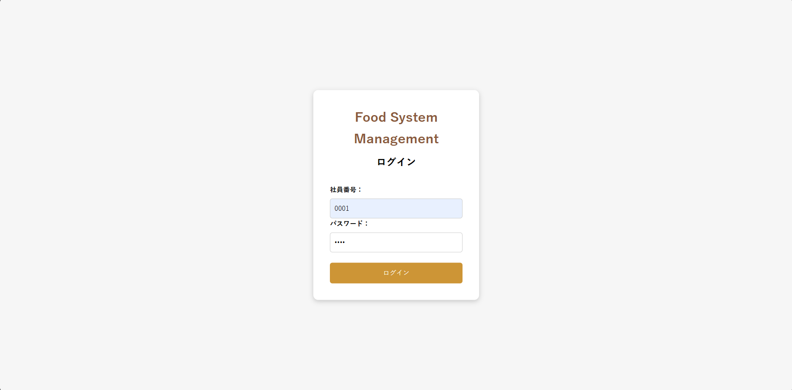](foodsystemmanagement/docs/images/login.png)

## トップ画面
[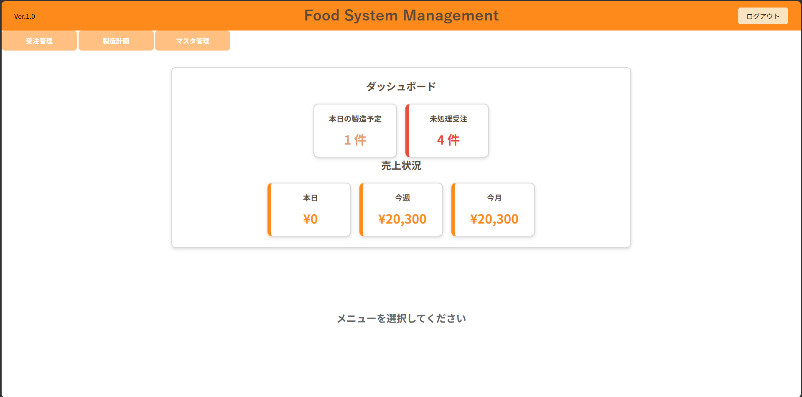](foodsystemmanagement/docs/images/top.png)

## トップ画面（タグクリック時）
[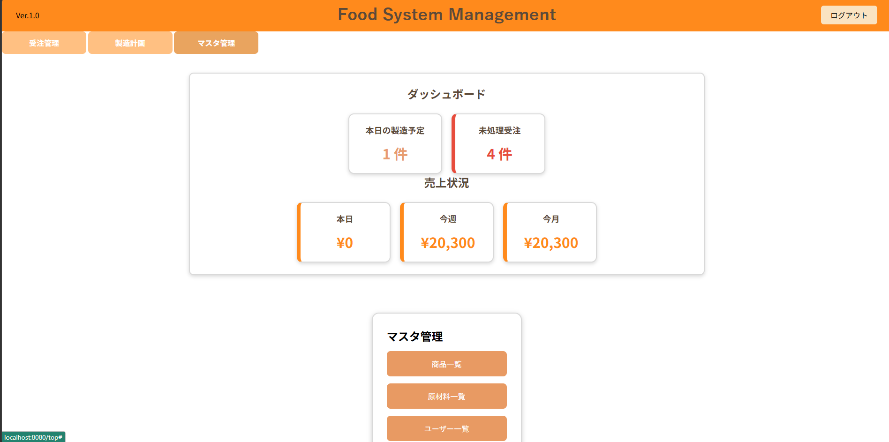](foodsystemmanagement/docs/images/top_click.png)

## 原材料一覧画面
[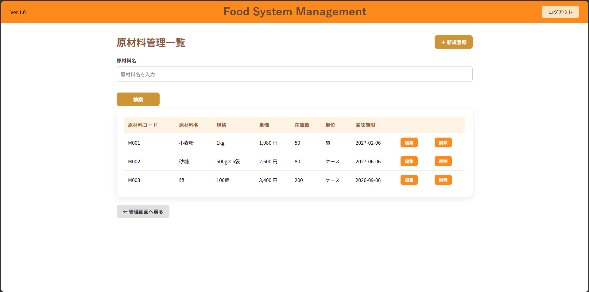](foodsystemmanagement/docs/images/material_list.png)

## 商品一覧画面
[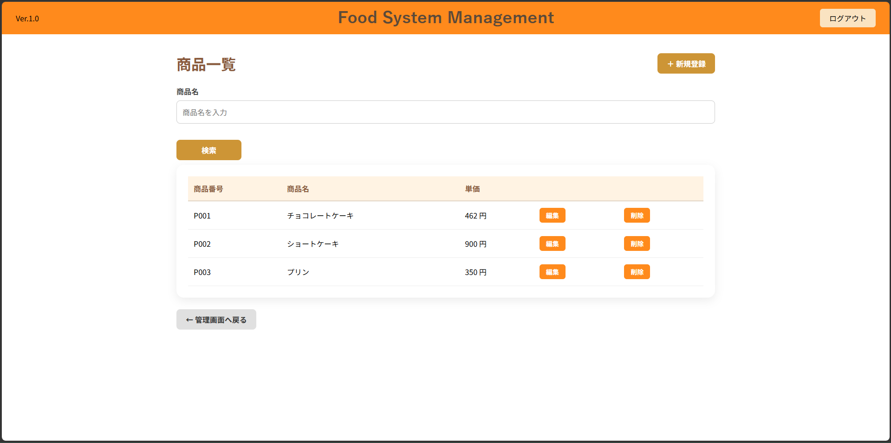](foodsystemmanagement/docs/images/product_list.png)

## 製造計画画面
[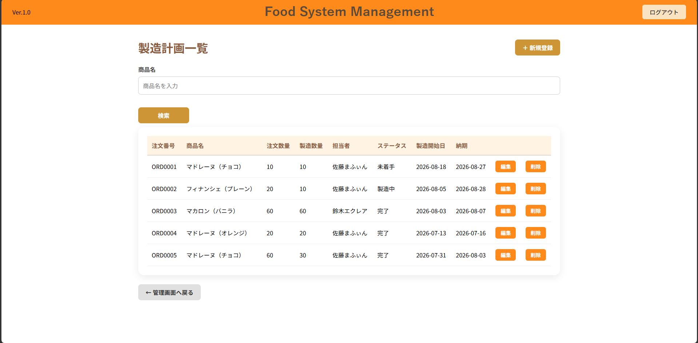](foodsystemmanagement/docs/images/produtionplan_list.png)

## 受注一覧画面
[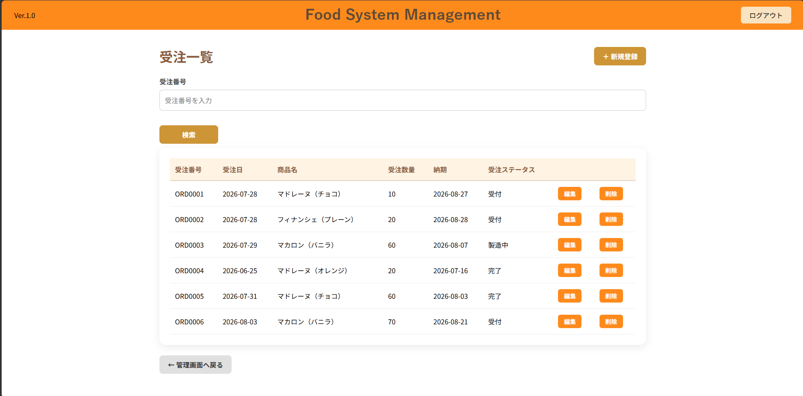](foodsystemmanagement/docs/images/order_list.png)

## 受注登録画面
[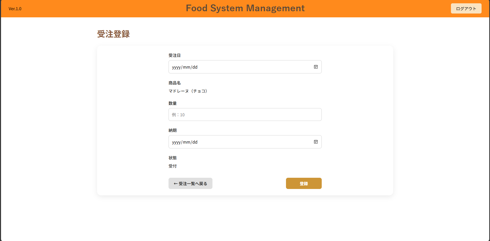](foodsystemmanagement/docs/images/order_create.png)

## 受注編集画面
[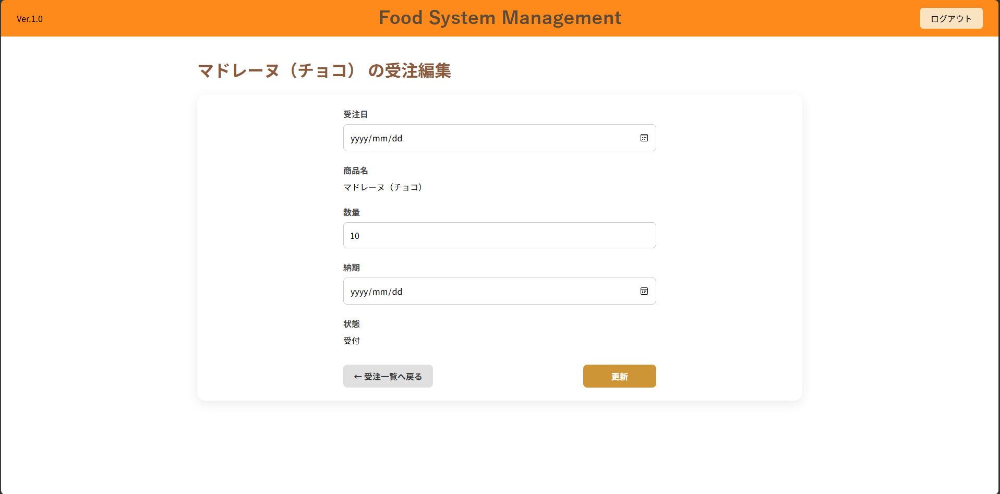](foodsystemmanagement/docs/images/order_update.png)

## ユーザー一覧画面
[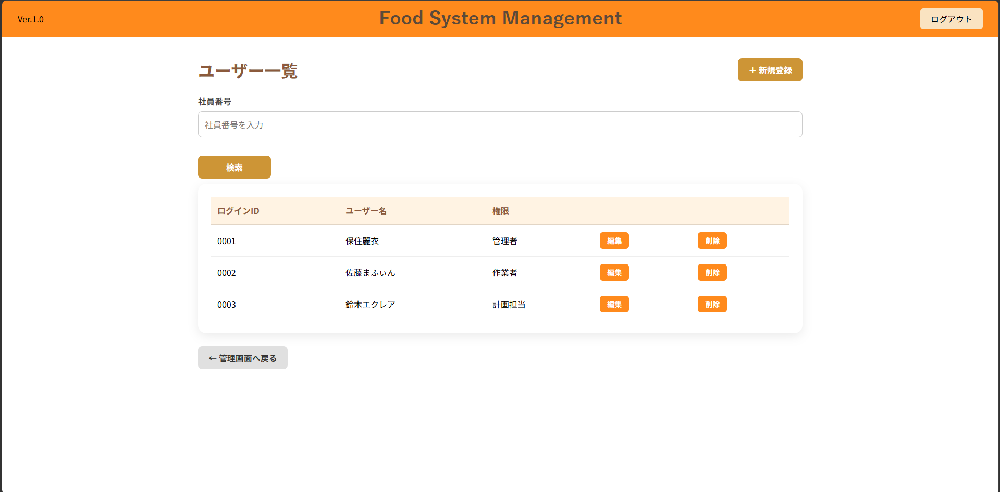](foodsystemmanagement/docs/images/user_list.png)

## ユーザー新規登録画面
[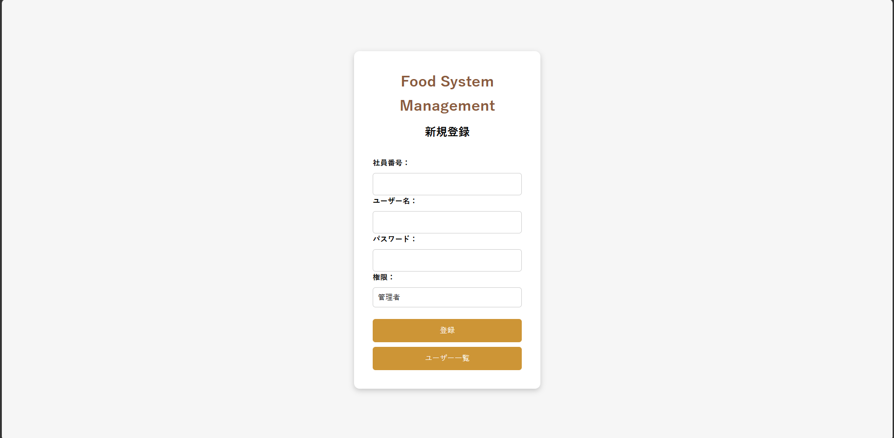](foodsystemmanagement/docs/images/user_register.png)


---


# 工夫した点

## 業務フローを意識した設計
単純なCRUDアプリではなく食品製造業務の流れを意識し、受注→製造計画作成→製造状況管理という実際の業務に近い構成を想定しました。<br>
また、受注数量に対して実際に製造した数量が変更になることも前職で経験したため、製造計画では注文数は読み込みのみにし、製造数量を設定できるようにしました。

## Spring Securityによる認証・認可
ログイン機能だけではなく、ユーザーの役割ごとの機能制御をしました。<br>
業務システムでは利用者によって操作範囲が異なるため、権限管理を実装しました。

## JPAによるデータ管理
EntityとRepositoryを利用し、データベース操作をオブジェクト指向で管理しました。


---


# 苦労した点

初めて一人でアプリケーション開発を行い、さらにフレームワークの自己学習しながら進めたため、手探りの状態から開発を始める難しさを強く感じました。<br>
当初はシステムや認証・認可、アクセス制御、画面遷移、エンティティ設計などを十分に検討したうえで開発を開始しましたが、実際に実装を進める中で多くの設計を見直し、大幅な修正を繰り返しました。設計と実装を往復しながら改善していくことの重要性を実感しました。<br>
特に苦労したのは、Thymeleafのテンプレートとバックエンドコードのデータの受け渡しや記述方法、そしてMVCアーキテクチャの処理の流れを理解することでした。エラーが発生するたびに原因を調査し修正を繰り返すことで、一つひとつ知識を積み重ねていきました。<br>
完成が近づくころには、エラーメッセージから原因をある程度予測できるようになり、問題の切り分けや修正も開発当初よりスムーズに行えるようになりました。アプリケーションと向き合い続けた時間がそのまま実践的な経験と知識につながったと感じています。<br>
プログラミングを学び始めて約半年ですが、今後も多くのトライアンドエラーを経験しながら学習を継続し、より質の高い設計・実装ができるエンジニアを目指して成長していきたいと考えています。

# 今後追加予定の機能
- 在庫管理機能
- 売上管理
- 商品登録内容に原材料を追加
- 原材料使用量による在庫減算
- 操作履歴管理
- 検索対象項目の増設
- ダッシュボードをより実務に近い形で設計
- 権限に受発注担当者（事務）を追加
- 製造計画の納期を受注納期から-＊＊日と設定できるようにする
- 登録・編集時の製造日を本日の日付・登録した製造日を参照する
- CRUD時の未入力エラー表示
- 各画面で微細に異なるUIの調整

---

# 起動方法

### レポジトリをクローン

git clone https://github.com/rei-hozumi/Food-System-Management.git

### application.propertiesを設定

spring.datasource.url=jdbc:mysql://localhost:3306/food_system_management
spring.datasource.username=ご自身のMySQLユーザー名
spring.datasource.password=ご自身のMySQLパスワード

### データベース設定
MySQLを起動し、以下のデータベースを作成してください。

```sql
CREATE DATABASE food_system_management;
```
アプリケーション起動時にHibernateがEntity定義をもとに必要なテーブルを自動生成します。


### 初期設定済
```md
| ログインID |  パスワード |  権限   |
|   admin   |  admin123  |  ADMIN  |
|  planner  | planner123 | PLANNER |
|   worker  |  worker123 | WORKER  |

サンプル：商品・原材料・受注・製造計画も数件保存済みです。
```
※パスワードはデモ用です。


### アプリケーション起動
プロジェクトのルートディレクトリで以下を実行してください。

./mvnw spring-boot:run

または、IDE（Eclipse / IntelliJ IDEA）から
FoodSystemManagementApplication.java をSpring Bootアプリケーションとして実行してください。


### ブラウザでアクセス
起動後、以下のURLへアクセスしてください。

http://localhost:8080


### ログイン
登録済みユーザーでログインしてください。
権限によって利用できる機能が異なります。
- 権限	    利用可能機能
- ADMIN	    全機能
- PLANNER	  製造計画・受注管理など
- WORKER	  製造計画の確認・編集

